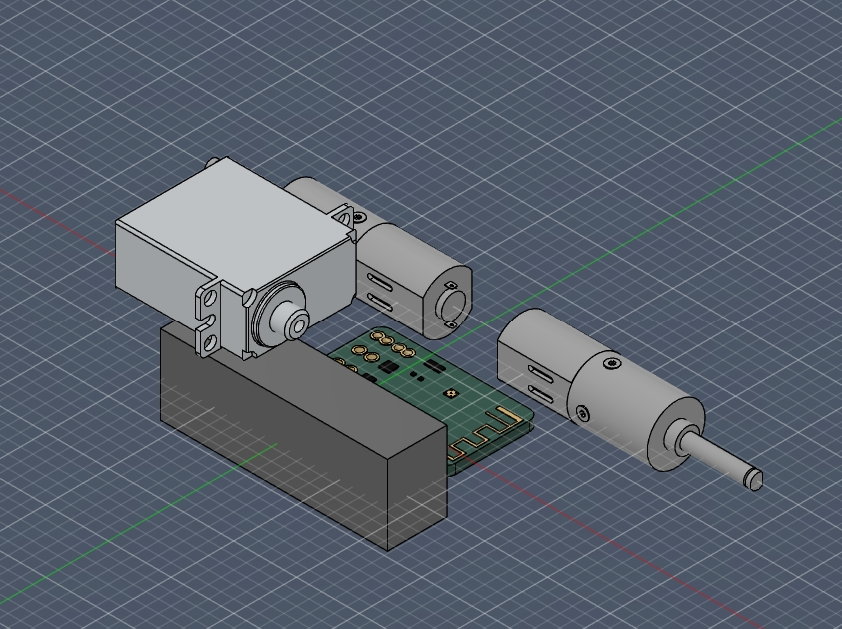
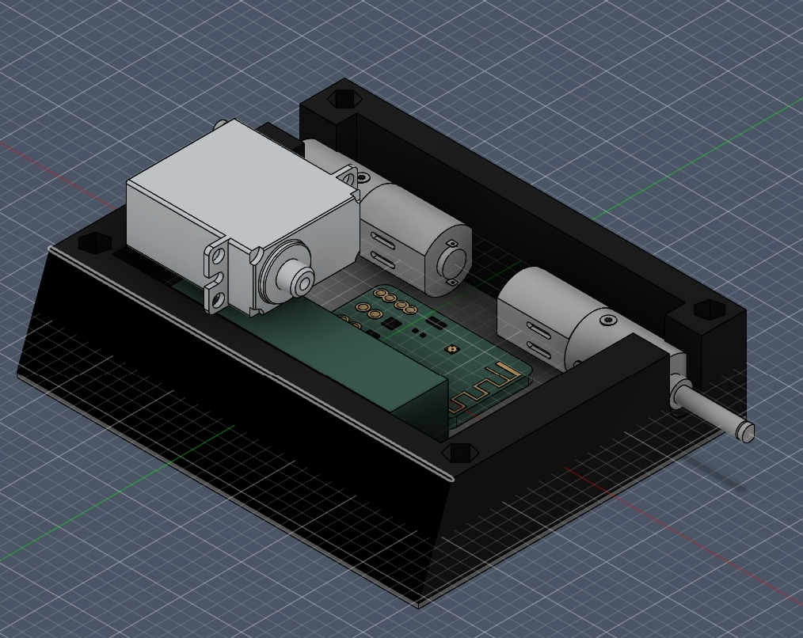
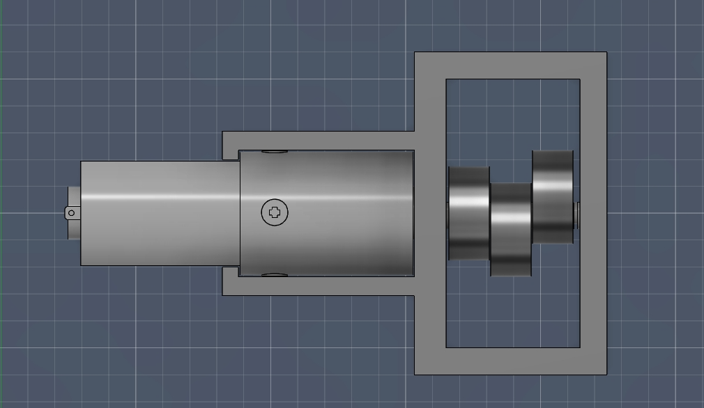
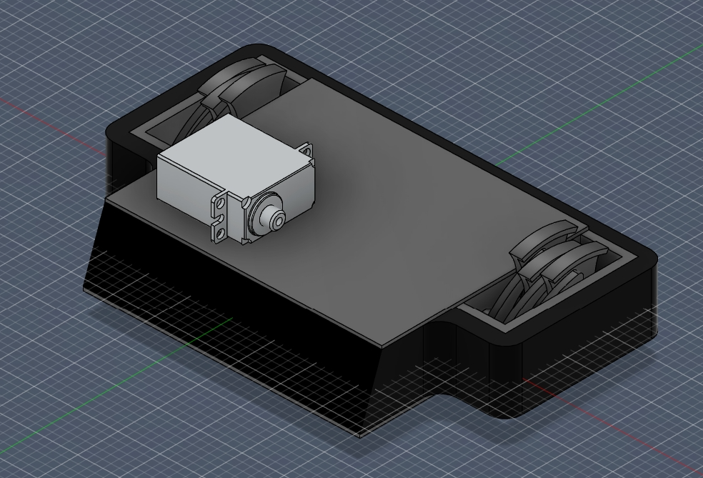

Day 1, 6/28/26:    
Today I began working on the electronics layout of my robot. For decent pushing power and little weight usage I decided to go with planetary n20s for my robot's drive system. To keep things simple and compact, I am controlling these through a Malenki-Nano board, which handles both the drive controller and reciever jobs. To operate the hugging mechanism I am using a KST DS215MG servo, mainly for its speed and reliability. All this is powered by a 2S 300mAh battery. Below is my current electronics positioning. This took around 20 minutes of work.

Day 2, 6/29/26:
I designed a rough TPU chassis to fit around the electronics, as well as polycarbonate top and bottom plates. I decided to use M2.5 aluminum standoffs to hold everything together. This process took 37 minutes.

Working on the basis of the drive motor mount and cam for the shuffler mechanism. The shuffler mechanism is inspired by this design: https://www.digikey.com/en/maker/tutorials/2024/how-to-make-a-robot-shuffler-mechanism?msockid=0ded191f765d630021090a7e725d6dfe. I am planning on printing this out of PLA+ or PETG since this part is caged in TPU and therefore won't need to take a direct hit, and it'll keep things simple. Also made significant changes to chassis in order to fit this new portion. I removed the side walls and back wall, which I will add back in later once the essentials are in place. This has taken 45 minutes so far. Here is my motor mount:

I spent a good hour working on the shuffler legs, adjusting them to fit the robot. I went for three legs per side to enduce clean motion without using too much weight. Since I am using a compliant shuffler mechanism, I will be printing these legs out of TPU. I also remade the TPU chassis and armor, fitting it better to the overall design.

I spent 36 minutes refining the details, mostly the coloration, of the robot. I also took the time to start on one of the hugger forks. These will hang around around the outside of the bot and then snap inwards when triggered by the servo. Just a rough draft right now.
