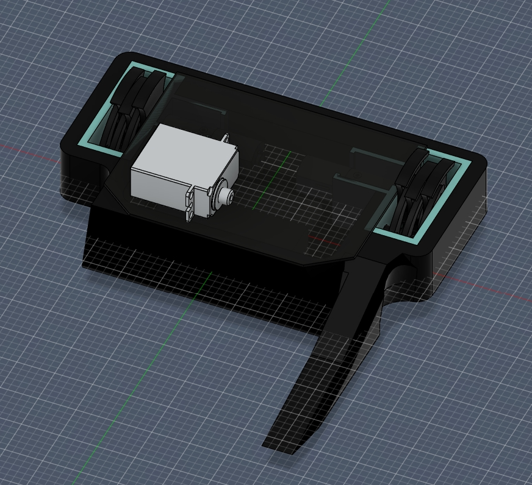
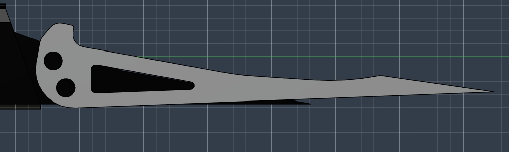

Day 1, 6/28/26:    
Today I began working on the electronics layout of my robot. For decent pushing power and little weight usage I decided to go with planetary n20s for my robot's drive system. To keep things simple and compact, I am controlling these through a Malenki-Nano board, which handles both the drive controller and reciever jobs. To operate the hugging mechanism I am using a KST DS215MG servo, mainly for its speed and reliability. All this is powered by a 2S 300mAh battery. Below is my current electronics positioning. This took around 20 minutes of work.

Day 2, 6/29/26:
I designed a rough TPU chassis to fit around the electronics, as well as polycarbonate top and bottom plates. I decided to use M2.5 aluminum standoffs to hold everything together. This process took 37 minutes.

Working on the basis of the drive motor mount and cam for the shuffler mechanism. The shuffler mechanism is inspired by this design: https://www.digikey.com/en/maker/tutorials/2024/how-to-make-a-robot-shuffler-mechanism?msockid=0ded191f765d630021090a7e725d6dfe. I am planning on printing this out of PLA+ or PETG since this part is caged in TPU and therefore won't need to take a direct hit, and it'll keep things simple. Also made significant changes to chassis in order to fit this new portion. I removed the side walls and back wall, which I will add back in later once the essentials are in place. This has taken 45 minutes so far. Here is my motor mount:

      I spent a good hour working on the shuffler legs, adjusting them to fit the robot. I went for three legs per side to enduce clean motion without using too much weight. Since I am using a compliant shuffler mechanism, I will be printing these legs out of TPU. I also remade the TPU chassis and armor, fitting it better to the overall design.

       I spent 36 minutes refining the details, mostly the coloration, of the robot. I also took the time to start on one of the hugger forks. These will hang around around the outside of the bot and then snap inwards when triggered by the servo. Just a rough draft right now.

         Day 3, 6/30/26:
     I took the time to refine the current details in the robot, filleting and chamfering where needed. I also added the holes for the standoffs I'm going to use to connect the top and bottom plates, as well as refined the motor mounts and indented the back TPU armor (this with the purpose of saving weight and looking cooler). This process took 40 minutes. I spent another 34 minutes coming up with and editing a design for the inner forks. To compliment the hugger forks, I am using two standard forks between them, made out of 1.5mm aluminum. This will significantly increase the likelyhood of getting under enemy robots, which is crucial to combat robotics.

I spent 26 minutes designing the fork mounts, where the forks connect to the chassis, and a TPU servo protector. The servo protector will both mount the servo to the robot and provide an extra layer of defense incase that part gets hit.
The Hugger forks weren't turning out how I wanted them to, so I took the time to reshape one side. Instead of going straight foward, the fork funnels outward, hopefully providing a better probability of sucess. Also, it looks way cooler and more unique. About 30 minutes to do this. Next I am going to create the holes to run string through the hugger arms, which is what will cause them to bend. 
PICTURE!!!!!!!!!!!
            Day 4, 7/1/26
            I am designing what are essentially tunnels for the string to go through for a few reasons. First off, these tunnels protect the string from attacks. Second, they help corral the string, making movements more consistent and accurate. These are essentially the arteries of the robot. I am running them from the tips of the hugger forks to the servo. I spent 1 hour and 17 minutes this session finalizing the design. I adjusted the arteries so they reached the correct locations, then mirrored the new hugging fork to the other side. Next I got to work designing a decoration that was incorporated into the servo guard. I was going for a kind of 'cool hand' design, though I ended up with something more like 'feverish splat'. Oh well, still adds some nice detail to the bot. Each finger goes to a screw hole, which also helps mount the servo securely. I added a fingertech switch, which turns the bot on and off, because I forgot to earlier. I also added a battery wall in order to keep the electronics more organized. Finally, I cadded the servo horn on top. Now it's just weight calcs from here (hopefully).
